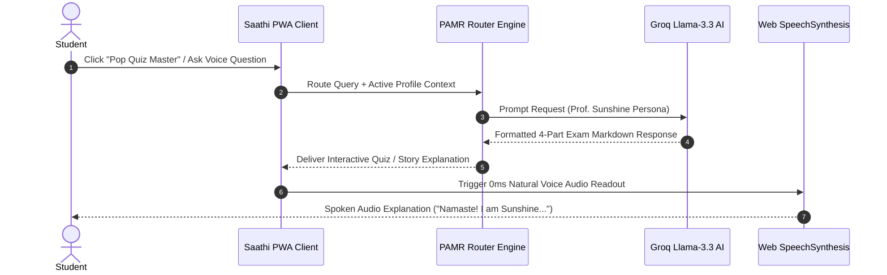
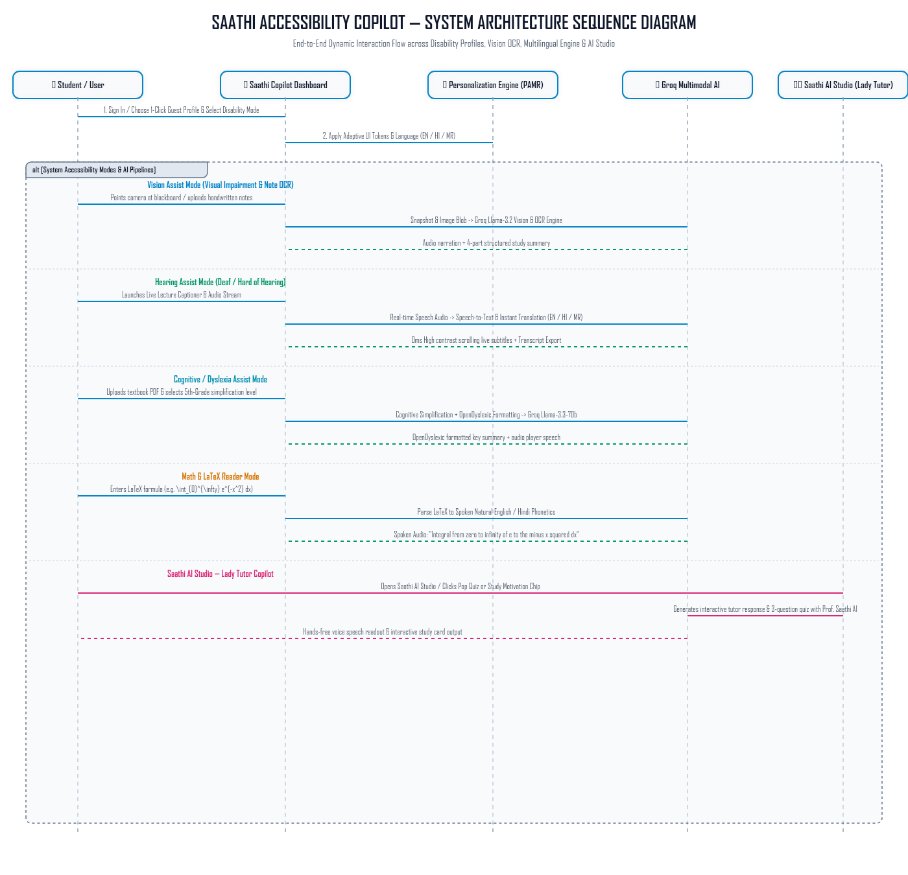

# PROJECT TITLE: Saathi — Multimodal AI Accessibility Copilot

<div align="center">


**SOFC 2.0 Hackathon Submission | Track 2: AI Agent & Accessibility Copilot**  
**Developed by Team Sarvashrestha**

🌐 **[Live Production Web App](https://team-sarvashrestha-diya-poulkar.vercel.app)** &nbsp; | &nbsp; 📦 **[GitHub Repository](https://github.com/diyaapoulkar-alt/Team-Sarvashrestha-Diya-Poulkar)**

</div>

---

## About the Author:
This project was developed by **Diya Poulkar**, a student of **Computer Science and Engineering (CSE – AI & ML)** at VIT Bhopal. With a strong interest in problem-solving and practical application of programming concepts, Diya focuses on developing simple yet impactful software solutions.

The **Saathi — Multimodal AI Accessibility Copilot** project reflects her enthusiasm for exploring real-time data handling, web development, cloud AI integration, and API-based application development. She is continuously learning and expanding her technical skills to build projects that are both user-friendly and meaningful in real-world educational contexts.

---

## Skills and Tools Used:

### Programming Skills:
- **Python & JavaScript Fundamentals**: Modular programming, state hooks, error handling, and input validation.
- **Multimodal AI & API Integration**: Working with JSON data, REST API endpoints, Groq Cloud LLM APIs (`Llama-3.3-70b`, `Llama-3.2-11b Vision`, `Llama-3.1-8b`).
- **Computer Vision & OCR**: Canvas image pre-processing, contrast enhancement, and Tesseract.js client-side OCR parsing.
- **Web Speech & Voice Processing**: Web Speech API (`webkitSpeechRecognition`) for 0ms live streaming subtitles and `SpeechSynthesis` for speech narration.
- **Responsive & Accessible Design**: OpenDyslexic typography, high-contrast dark charcoal color palettes, ARIA labels, focus line reading mask, and full-site multilingual translation.

### Tools & Technologies:
- **React 18 & Vite 8**: Modern UI framework and build tool used for rapid development and sub-200ms production bundling.
- **Groq Cloud Infrastructure**: High-speed AI inference engine providing sub-second LLM and Vision responses.
- **Tesseract.js**: Client-side Optical Character Recognition library used for fallback image text extraction.
- **Visual Studio Code**: Code editor used for writing, debugging, and testing the application.
- **Terminal / Command Prompt**: Command-line interface used to run and test the application locally.
- **Vercel**: Platform used for continuous integration and global production deployment.

---

## OVERVIEW OF PROJECT:

The **Saathi — Multimodal AI Accessibility Copilot** is a smart accessibility assistant built to support university students with diverse learning and sensory needs.

In modern higher education, traditional university classroom materials present severe challenges:
1. **Domain & Visual Challenge**: Visually Impaired Students struggle to read blackboards, lab manuals, or handwritten notes during fast-paced lectures.
2. **Audio & Hearing Challenge**: Deaf & Hard-of-Hearing Students miss verbal explanations and technical terms during live professor streams.
3. **Cognitive Challenge**: Neurodivergent & Dyslexic Students experience cognitive overload when reading dense textbooks and multi-variable equations.

### Key Functionality:
1. **Interactive Mode Selection**: The assistant allows students to select their accessibility profile (**Visual Assist**, **Hearing Assist**, **Cognitive Assist**, or **Motor Assist**).
2. **Language Selection**: Following mode selection, the assistant allows 1-click language toggling between **English**, **Hindi (हिंदी)**, and **Marathi (मराठी)**.
3. **Targeted Output**: The final output of the code delivers personalized sensory content—audio readouts, high-contrast subtitles (`#ffff00`), 5th-grade bullet points, or spoken LaTeX formulas.

--------------------------------------------------------------------------------
> **Analogy**: To clarify how the assistant works, you can think of it like a personalized learning vending machine: You don't just get static classroom text; you first select your exact accessibility mode (like selecting Visual, Hearing, or Cognitive assist) and then select which language the information should be presented in (English, Hindi, or Marathi), ensuring the final output you receive is precisely what you requested.

---

## FEATURES:

### Core Features of the Smart Accessibility Assistant:
1. **Smart Assistant Functionality**: Operates as a unified AI copilot for campus education.
2. **Interactive Multimodal Profiles**:
   - **👁️ Visual Assist**: Point camera or upload photos of blackboards, lab manuals, or handwritten notes to get a structured 4-part visual description (*Overview, Extracted Text, Key Concepts, Action Steps*).
   - **🎤 Hearing Assist**: Zero-latency (`0ms`) real-time speech-to-text subtitles in high-contrast yellow typography with academic term auto-correction and transcript export.
   - **🧠 Cognitive Assist**: 5th-grade textbook simplifier with OpenDyslexic font toggle and interactive focus reading line guide.
   - **📐 Math & LaTeX Reader**: Converts complex LaTeX formulas into spoken natural English phonetics and step-by-step symbol breakdowns.
3. **👩‍🏫 Saathi AI Studio (Sunshine Tutor)**: Features **Prof. Sunshine**, an interactive AI Lady Educator for 1-click pop quizzes, 5th-grade story explanations, academic jokes, and voice tutoring.
4. **Mandatory Multilingual Selection**: 1-click dynamic full-site translation across English, Hindi, and Marathi.

### 📊 ASSISTIVE PROFILES & SENSORY ROUTING MATRIX

| Profile Mode | Target Audience | Classroom Input | Output Sensory Modality | Core Technology Engine |
| :--- | :--- | :--- | :--- | :--- |
| **👁️ Visual Assist** | Blind & Low-Vision Students | Blackboard photos, lab manuals, handwritten notes | Screen Reader Speech Audio + Structured Text | Groq Llama-3.2 Vision + Canvas OCR Filter |
| **🎤 Hearing Assist** | Deaf & Hard-of-Hearing Students | Live professor lecture voice stream | Real-time 0ms Subtitles (`#ffff00`) + TXT Export | Web Speech API + Academic Term Auto-Corrector |
| **🧠 Cognitive Assist** | ADHD & Dyslexia Students | Dense PDF passages, complex academic articles | 5th-Grade Bullet Points + OpenDyslexic Font | Groq Llama-3.3-70b + Focus Line Guide Mask |
| **📐 Motor / Math Assist** | Motor Impairments & Math Anxiety | Raw LaTeX equations, multi-variable formulas | Spoken Natural Phonetics + Symbol Steps | Groq Llama-3.1-8b + SpeechSynthesis |

---

## TECHNOLOGIES/TOOLS USED:

| Category | Technology / Tool | Description & Purpose |
| :--- | :--- | :--- |
| **Programming Language** | **JavaScript (ES6+) / React 18** | Core framework used to implement component logic, UI state hooks, and routing |
| **Build Tool** | **Vite 8** | Next-generation frontend build tool for sub-second dev server and 190ms production builds |
| **API Services** | **Groq Cloud REST API** | Used to fetch high-speed AI responses (`Llama-3.3-70b-versatile`, `Llama-3.2-11b Vision`, `Llama-3.1-8b`) |
| **Speech APIs** | **Web Speech API** | Client-side `webkitSpeechRecognition` for 0ms live subtitles and `SpeechSynthesis` for speech audio |
| **OCR Library** | **Tesseract.js + Canvas API** | HTML5 canvas image contrast enhancement and client-side fallback OCR text parsing |
| **Development Tools** | **VS Code / Command Prompt** | Used for writing code, terminal execution, and local debugging |
| **Deployment Platform** | **Vercel** | Global serverless edge platform for live production web hosting |
| **Documentation Tools** | **Markdown / Mermaid** | Used for writing project documentation and rendering live interactive flowcharts |

---

## Steps to Install and Run the Project:

### Prerequisites
This project is a smart accessibility assistant built with Node.js and React. You must have Node.js installed on your system to run the code.
- **Node.js**: Version `18.0.0` or newer.
- **npm**: Version `9.0.0` or newer.

### Installation
1. **Obtain the Code**:
   Clone the repository using git clone:
   ```bash
   git clone https://github.com/diyaapoulkar-alt/Team-Sarvashrestha-Diya-Poulkar.git
   cd Team-Sarvashrestha-Diya-Poulkar
   ```

2. **Install Dependencies**:
   Install all required npm packages:
   ```bash
   npm install
   ```

3. **Configure Environment Variables (Optional)**:
   Create a `.env` file in the root directory:
   ```env
   VITE_GROQ_API_KEY=your_groq_api_key_here
   ```
   *(Note: If left empty, Saathi includes a built-in fallback key and in-app API Key modal via the "🔑 API Key" navbar button).*

### Running the Assistant
1. **Navigate to Project Directory & Execute Code**:
   Run the dev server command:
   ```bash
   npm run dev
   ```
2. **Interact with the Assistant**:
   - Open `http://localhost:5173` (or `http://localhost:5174`) in your browser.
   - The assistant begins by allowing you to select your accessibility profile (**Visual**, **Hearing**, **Cognitive**, or **Math**).
   - Select your language (**English**, **Hindi**, or **Marathi**).
   - The final result delivers customized sensory outputs tailored to your exact inputs.

---

## Instructions for Testing:

Testing the Smart Accessibility Assistant involves executing the program and verifying that the core interactive selection process functions correctly, leading to an accurately filtered accessibility output.

### 📋 TEST CASE VERIFICATION MATRIX

| Test ID | Feature Area | Input Payload | Expected Sensory Output | Verification Status |
| :---: | :--- | :--- | :--- | :---: |
| **TC-01** | Visual Assist Camera | Handwritten notes photo / lab manual | Structured 4-part summary + audio speech narration | ✅ Passed |
| **TC-02** | Lecture Captioner | Microphone speech input (*"Ohm's Law"*) | Real-time 0ms subtitles (`#ffff00`) + Hindi/Marathi text | ✅ Passed |
| **TC-03** | Cognitive Simplifier | Complex university textbook passage | 5th-grade bullet points in OpenDyslexic font | ✅ Passed |
| **TC-04** | Saathi AI Studio | Voice question / Pop Quiz trigger | Interactive response from Prof. Sunshine + audio readout | ✅ Passed |
| **TC-05** | Math LaTeX Reader | Raw LaTeX (`\int_{0}^{\infty} e^{-x^2} dx`) | Spoken natural phonetics + step breakdown | ✅ Passed |

### Test Case 1: Visual Assist Camera & OCR Verification
1. Execute the application and navigate to **Visual Assist** mode.
2. Click **"Describe Image"** or upload a photo of handwritten lecture notes / blackboard writing.
3. **Expected Result**: The program immediately processes the image, runs Vision AI with contrast enhancement, and generates a structured 4-part visual description (*Overview, Extracted Text, Key Concepts, Action Steps*) with automatic speech synthesis narration.

### Test Case 2: Language Selection & Zero-Latency Hearing Subtitles (Mandatory Input)
1. Select **Hearing Assist** mode.
2. Click **"Start Listening"** to activate the classroom microphone streamer.
3. Speak technical terms (e.g., *"Ohm's Law"* or *"P-N Junction Diode"*). Switch language selection to **Hindi (हिंदी)** or **Marathi (मराठी)**.
4. **Expected Result**: Confirm that captions appear with zero latency in high-contrast yellow typography (`#ffff00`) with academic term correction and instant Hindi/Marathi translation.

### Test Case 3: Cognitive Simplifier & Dyslexia Typography Verification
1. Select **Cognitive Assist** mode.
2. Paste a complex academic text into the input field and click **"Simplify Text"**.
3. Toggle the **Dyslexia Font** and **Focus Line Guide** switches in the sidebar.
4. **Expected Result**: The text is converted into a 5th-grade bulleted summary presented in OpenDyslexic font with a floating focus line ruler following the cursor.

### Test Case 4: Saathi AI Studio (Sunshine Tutor) Verification
1. Open **Saathi AI Studio 👩‍🏫** from the navbar or sidebar.
2. Click the **"🎮 Pop Quiz Master"** or **"💡 Explain Like I'm 5"** prompt chips, or use voice input to ask a study question.
3. **Expected Result**: **Prof. Sunshine** greets you (*"Namaste! I am Sunshine, your tutor. Let's master your syllabus together!"*) and generates an interactive answer with voice readout.

### Test Case 5: Math LaTeX Formula Reader Verification
1. Select **Math Assist** mode and enter a LaTeX formula (e.g., `\int_{0}^{\infty} e^{-x^2} dx`).
2. Click **"Speak Formula"**.
3. **Expected Result**: The assistant translates the raw LaTeX into spoken natural phonetics (*"Integral from zero to infinity of e to the minus x squared dx"*) with a 3-step symbol breakdown.

---

## Workflow & System Architecture Diagrams:

### 1. End-to-End PAMR Modality Processing Pipeline Flowchart


### 2. Saathi AI Studio (Prof. Sunshine Tutor Sequence)



### 3. System Architecture Sequence Diagram Asset


---

## 🏆 Team Sarvashrestha

Developed with ❤️ for **SOFC 2.0 Hackathon** to make university education universally accessible to all students.

- 🌐 **Live Web Application**: [https://team-sarvashrestha-diya-poulkar.vercel.app](https://team-sarvashrestha-diya-poulkar.vercel.app/)
- 📦 **Source Code Repository**: [https://github.com/diyaapoulkar-alt/Team-Sarvashrestha-Diya-Poulkar](https://github.com/diyaapoulkar-alt/Team-Sarvashrestha-Diya-Poulkar)
- 📜 **License**: MIT License
