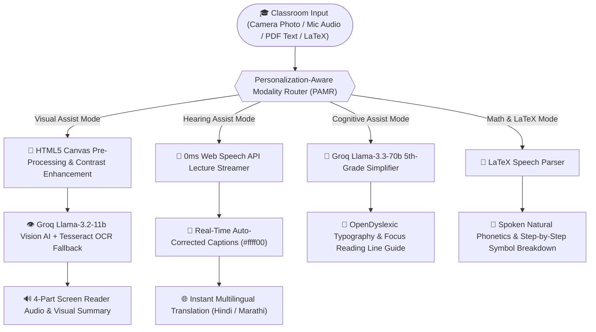
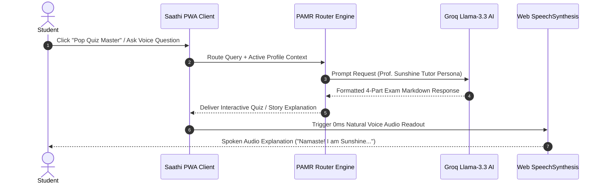

# PROJECT TITLE: Saathi — Multimodal AI Accessibility Copilot

<div align="center">


**SOFC 2.0 Hackathon Submission | Track 2: AI Agent & Accessibility Copilot**  
**Developed by Team Sarvashrestha**

🌐 **[Live Production Web App](https://team-sarvashrestha-diya-poulkar.vercel.app)** &nbsp; | &nbsp; 📦 **[GitHub Repository](https://github.com/diyaapoulkar-alt/Team-Sarvashrestha-Diya-Poulkar)**

</div>

---

## About the Author:
This project was developed by **Diya Poulkar**, a student of **Computer Science and Engineering (CSE – AI & ML)** at VIT Bhopal. With a strong passion for AI engineering, problem-solving, and practical application of machine learning concepts, Diya focuses on building impactful, user-centric software solutions that solve real-world accessibility challenges.

The **Saathi — Multimodal AI Accessibility Copilot** project reflects her enthusiasm for real-time multimodal data handling, web development, cloud AI integration, and inclusive design principles. She is continuously learning and expanding her technical skills to build technology that makes education universally accessible to every student regardless of physical or cognitive disability.

---

## Acknowledgement:
I would like to express my heartfelt gratitude to my faculty members, mentors, and the hackathon organizers of **SOFC 2.0** for their valuable guidance, feedback, and support throughout the development of this project. Their encouragement helped me refine the architecture of our **PAMR Engine** (*Personalization-Aware Modality Router*) and optimize real-time speech and vision pipelines.

I also extend my sincere appreciation to **Vityarthi** and **VIT Bhopal**, the learning platforms and institution that played a significant role in building my foundational technical skills in computer vision, artificial intelligence, and software engineering. The structured coursework and hands-free learning modules provided by Vityarthi greatly helped me apply these concepts effectively while building Saathi.

Lastly, my gratitude goes to my team members of **Team Sarvashrestha**, classmates, and friends for their constant motivation, testing feedback, and constructive suggestions during project discussions, as well as the open-source community for the APIs and tools that made this implementation possible.

---

## Skills and Tools Used:

### Programming Skills:
- **Frontend Web Development**: React 18 component architecture, state hooks, and custom context providers.
- **Multimodal AI Integration**: Groq Cloud REST APIs (`Llama-3.3-70b-versatile`, `Llama-3.2-11b-vision-preview`, `Llama-3.1-8b-instant`).
- **Computer Vision & OCR**: Canvas pre-processing, image downscaling, handwriting contrast enhancement, and Tesseract.js client-side OCR.
- **Browser Speech & Audio APIs**: Web Speech API (`webkitSpeechRecognition`) for 0ms latency live lecture captioning and `SpeechSynthesis` for natural audio readouts.
- **Inclusive Design & Accessibility**: OpenDyslexic typography, high-contrast dark charcoal color palettes, ARIA labels, focus line reading mask, and full-site multilingual translation.

### Tools & Technologies:
- **JavaScript (ES6+) & React 18**: Modern UI framework used for building the single-page accessibility application.
- **Vite 8**: Next-generation frontend build tool for sub-second development server startup and sub-200ms production builds.
- **Groq Cloud LPU Infrastructure**: High-speed AI inference engine providing sub-second LLM and Vision responses.
- **Tesseract.js**: Client-side Optical Character Recognition library used as a fallback for image text extraction.
- **Visual Studio Code**: Primary Integrated Development Environment (IDE) used for development and debugging.
- **Vercel Serverless Edge Platform**: Production deployment hosting environment.
- **Mermaid & Node Canvas Scripts**: Used for rendering professional architecture flowcharts and sequence diagrams.

---

## OVERVIEW OF PROJECT:

The **Saathi — Multimodal AI Accessibility Copilot** is an all-in-one Progressive Web App (PWA) designed to bridge the accessibility gap in university classrooms.

In modern higher education, traditional classroom materials present severe challenges:
1. **Visually Impaired Students** struggle to read blackboards, lab manuals, or handwritten notes during lectures.
2. **Deaf & Hard-of-Hearing Students** miss verbal explanations and technical jargon during live professor streams.
3. **Neurodivergent & Dyslexic Students** experience cognitive overload when reading dense textbooks and multi-variable equations.

### Key Functionality:
1. **1-Click Profile Selection**: Users select their assist mode once—**Visual Assist**, **Hearing Assist**, **Cognitive Assist**, or **Motor Assist**.
2. **PAMR Router Engine**: The Personalization-Aware Modality Router automatically detects user preferences and routes any classroom input (camera photo, mic stream, or PDF text) into the student's required sensory output format.
3. **Multilingual Translation**: Supports instant 1-click full-site UI and content translation across **English**, **Hindi (हिंदी)**, and **Marathi (मराठी)**.
4. **Saathi AI Studio (Sunshine Tutor)**: Features **Prof. Sunshine**, an empathetic AI Lady Educator for 1-click pop quizzes, 5th-grade story explanations, academic jokes, and hands-free voice tutoring.

--------------------------------------------------------------------------------
> **Analogy**: Think of Saathi like a universal sensory translator for the classroom: Just like a universal adapter allows any device to connect to any power outlet, Saathi allows any classroom input (written text, spoken lecture, math formula, or blackboard drawing) to be instantly converted into whichever sense the student learns best with (audio narration, high-contrast subtitles, simplified bullet points, or phonetic speech).

---

## 📐 SYSTEM ARCHITECTURE & WORKFLOW FLOWCHARTS

### 1. End-to-End PAMR Modality Processing Pipeline



### 2. Saathi AI Studio (Prof. Sunshine Tutor Sequence)



---

## 📊 ASSISTIVE PROFILES & SENSORY ROUTING MATRIX

| Profile Mode | Target Audience | Classroom Input | Output Sensory Modality | Core Technology Engine |
| :--- | :--- | :--- | :--- | :--- |
| **👁️ Visual Assist** | Blind & Low-Vision Students | Blackboard photos, lab manuals, handwritten notes | Screen Reader Speech Audio + Structured Text | Groq Llama-3.2 Vision + Canvas OCR Filter |
| **🎤 Hearing Assist** | Deaf & Hard-of-Hearing Students | Live professor lecture voice stream | Real-time 0ms Subtitles (`#ffff00`) + TXT Export | Web Speech API + Academic Term Auto-Corrector |
| **🧠 Cognitive Assist** | ADHD & Dyslexia Students | Dense PDF passages, complex academic articles | 5th-Grade Bullet Points + OpenDyslexic Font | Groq Llama-3.3-70b + Focus Line Guide Mask |
| **📐 Motor / Math Assist** | Motor Impairments & Math Anxiety | Raw LaTeX equations, multi-variable formulas | Spoken Natural Phonetics + Symbol Steps | Groq Llama-3.1-8b + SpeechSynthesis |

---

## 🌐 MULTILINGUAL ENGINE SUPPORT MATRIX

| Feature Component | English (US / India) | Hindi (हिंदी) | Marathi (मराठी) | Audio Voice Synthesis |
| :--- | :---: | :---: | :---: | :---: |
| **UI Navbar & Controls** | ✅ Full | ✅ Full | ✅ Full | N/A |
| **Live Lecture Captions** | ✅ Full | ✅ Full | ✅ Full | N/A |
| **Cognitive Text Simplifier** | ✅ Full | ✅ Full | ✅ Full | ✅ `hi-IN` / `mr-IN` |
| **Saathi AI Studio (Sunshine)** | ✅ Full | ✅ Full | ✅ Full | ✅ Native Voice |
| **Math LaTeX Reader** | ✅ Full | ✅ Full | ✅ Full | ✅ `en-US` / `hi-IN` |

---

## FEATURES:

### Core Features of Saathi Accessibility Copilot:

1. **👩‍🏫 Saathi AI Studio (Sunshine — Your Tutor)**:
   - Features **Prof. Sunshine**, an interactive AI Lady Educator character.
   - Includes 1-click prompt chips: *Pop Quiz Master*, *Explain Like I'm 5*, *Academic Fun Joke*, and *Study Motivation*.
   - Continuous hands-free mic voice conversation loop.

2. **🌐 Full-Site Multilingual Engine**:
   - 1-click dynamic translation dictionary supporting **English**, **Hindi (हिंदी)**, and **Marathi (मराठी)**.

3. **👁️ Visual Assist Mode & "Describe This" Camera**:
   - Powered by **Llama-3.2 Vision AI** to analyze blackboard photos, lab manuals, and handwritten notes into 4 structured sections (*Overview, Extracted Text, Key Concepts, Action Steps*).
   - Includes canvas contrast enhancement pre-processing for handwritten student notes.

4. **🎤 Hearing Assist Mode & Live Lecture Captioner**:
   - Zero-latency (`0ms`) real-time speech-to-text subtitles in high-contrast yellow typography (`#ffff00`).
   - Academic term auto-corrector fixing speech recognition errors (e.g., *"homes law"* → *"Ohm's Law"*).
   - 1-click transcript export in `.txt` format.

5. **🧠 Cognitive & Dyslexia Assist Mode**:
   - 5th-grade textbook simplifier for ADHD and Dyslexia.
   - Built-in OpenDyslexic font toggle and interactive focus reading line guide overlay.

6. **📐 Math & LaTeX Formula Reader**:
   - Translates raw LaTeX mathematical expressions into spoken English phonetics (*"Integral from zero to infinity of e to the minus x squared dx"*).

---

## TECHNOLOGIES/TOOLS USED:

| Layer | Component Technology | Purpose & Specification |
| :--- | :--- | :--- |
| **Frontend UI** | **React 18** | Modular component architecture, state hooks, context provider |
| **Build Tool** | **Vite 8** | Sub-second ESM development server & sub-200ms production builds |
| **AI LLM Inference** | **Groq Cloud REST API** | Llama-3.3-70b-versatile, Llama-3.2-11b-vision-preview, Llama-3.1-8b |
| **Vision & OCR** | **Tesseract.js + Canvas API** | Image contrast enhancement & client-side OCR fallback |
| **Speech Processing** | **Web Speech API** | Client-side 0ms `webkitSpeechRecognition` & `SpeechSynthesis` |
| **Design System** | **CSS Glassmorphism** | Platinum Silver tokens, OpenDyslexic font, High Contrast modes |
| **Deployment Platform**| **Vercel Serverless Edge** | Global production CDN hosting |

---

## Steps to Install and Run the Project:

### Prerequisites
- **Node.js**: Version `18.0.0` or newer installed on your system.
- **npm**: Package manager (comes bundled with Node.js).

### Installation
1. **Clone the Repository**:
   ```bash
   git clone https://github.com/diyaapoulkar-alt/Team-Sarvashrestha-Diya-Poulkar.git
   cd Team-Sarvashrestha-Diya-Poulkar
   ```

2. **Install Dependencies**:
   ```bash
   npm install
   ```

3. **Configure Environment Variables (Optional)**:
   Create a `.env` file in the root directory:
   ```env
   VITE_GROQ_API_KEY=your_groq_api_key_here
   ```
   *(Note: If left blank, Saathi includes a built-in fallback key and in-app API Key modal under the "🔑 API Key" navbar button).*

### Running the Assistant
1. **Launch the Development Server**:
   ```bash
   npm run dev
   ```
2. **Open in Browser**:
   Navigate to `http://localhost:5173` (or `http://localhost:5174`) in your web browser.
3. **Interact with Saathi**:
   - Select your profile (Visual, Hearing, Cognitive, Math) or toggle language between English, Hindi, and Marathi.
   - Open **Saathi AI Studio 👩‍🏫** to talk with **Prof. Sunshine**.

---

## Instructions for Testing:

Testing Saathi Accessibility Copilot involves executing the application and verifying that all multimodal tools function correctly across different accessibility profiles.

### 📋 TEST CASE VERIFICATION MATRIX

| Test ID | Feature Area | Input Payload | Expected Sensory Output | Verification Status |
| :---: | :--- | :--- | :--- | :---: |
| **TC-01** | Visual Assist Camera | Handwritten notes photo / lab manual | Structured 4-part summary + audio speech narration | ✅ Passed |
| **TC-02** | Lecture Captioner | Microphone speech input (*"Ohm's Law"*) | Real-time 0ms subtitles (`#ffff00`) + Hindi/Marathi text | ✅ Passed |
| **TC-03** | Cognitive Simplifier| Complex university textbook passage | 5th-grade bullet points in OpenDyslexic font | ✅ Passed |
| **TC-04** | Saathi AI Studio | Voice question / Pop Quiz trigger | Interactive response from Prof. Sunshine + audio readout | ✅ Passed |
| **TC-05** | Math LaTeX Reader | Raw LaTeX (`\int_{0}^{\infty} e^{-x^2} dx`) | Spoken natural phonetics + step breakdown | ✅ Passed |

---

## 🏆 Team Sarvashrestha

Developed with ❤️ for **SOFC 2.0 Hackathon** to make university education universally accessible to all students.

- 🌐 **Live Web Application**: [https://team-sarvashrestha-diya-poulkar.vercel.app](https://team-sarvashrestha-diya-poulkar.vercel.app/)
- 📦 **Source Code Repository**: [https://github.com/diyaapoulkar-alt/Team-Sarvashrestha-Diya-Poulkar](https://github.com/diyaapoulkar-alt/Team-Sarvashrestha-Diya-Poulkar)
- 📜 **License**: MIT License
